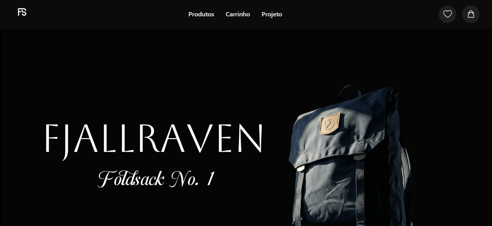

# 🛒 React E-Commerce com TypeScript & Testes

> Um projeto de e-commerce focado em componentização, gerenciamento de estado global e confiabilidade através de testes automatizados.

  

---

## 📸 Preview

---